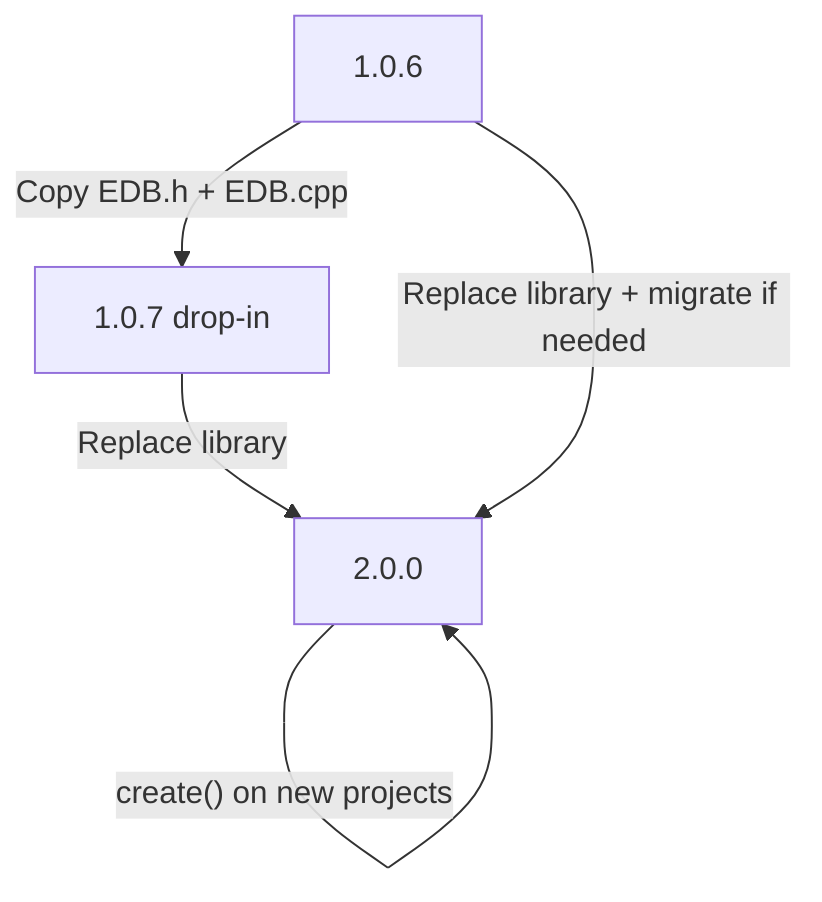

# EDB Upgrade Guide

This guide describes safe upgrade paths between EDB releases. Read it before replacing library files in a project that already has live data on EEPROM, SD, or SPIFFS.

> **2.0.0 uses the v3 on-disk format and does not upgrade older files in place.** Any v1/v2
> database must be converted offline with `tools/edb_migrate.py` (see [MIGRATION.md](MIGRATION.md));
> `open()` returns `EDB_NEEDS_MIGRATION` for a legacy file. The 1.0.7 line is a maintenance release
> that keeps the legacy file format. Always back up storage before upgrading to 2.0.0.

## Which release should I use?

| Your situation | Recommended release |
|----------------|---------------------|
| Existing project on 1.0.6, want zero risk | **1.0.7** (drop-in) |
| On 1.0.7 and want bug fixes only | Stay on **1.0.7** |
| New project | **2.0.0** |
| Need cross-platform `.db` files (AVR ↔ ESP32) | **2.0.0** + migration tool |
| SD/SPIFFS database created on a different MCU | **2.0.0** + `edb_migrate.py` |

---

## Path 1: 1.0.6 → 1.0.7 (drop-in)

**Best for:** Any existing 1.0.6 deployment where you want safety fixes without touching stored data.

### Steps

1. Back up your current `EDB.h` and `EDB.cpp` (optional but recommended).
2. Copy [`release/1.0.7/EDB.h`](../release/1.0.7/EDB.h) and [`release/1.0.7/EDB.cpp`](../release/1.0.7/EDB.cpp) into your Arduino `libraries/EDB/` folder.
3. Restart the Arduino IDE.
4. Recompile and upload your sketch — **no sketch changes required**.

### What changes

| Area | 1.0.6 | 1.0.7 |
|------|-------|-------|
| On-disk format | Unchanged | Unchanged |
| Public API | Unchanged | Unchanged |
| `recno == 0` | Silent corruption possible | Returns `EDB_OUT_OF_RANGE` |
| `open()` on bad header | Always `EDB_OK` | Returns `EDB_ERROR` |
| `create()` validation | Minimal | Validates params + read-back |
| Shift ops (`insertRec` / `deleteRec`) | No `malloc` check | Returns `EDB_ERROR` on allocation failure |

### Data migration

**None.** Existing EEPROM, SD, and SPIFFS databases are read and written using the same layout as 1.0.6.

### Rollback

Restore your backed-up 1.0.6 `EDB.h` and `EDB.cpp`. Data on storage is unaffected.

---

## Path 2: 1.0.7 → 2.0.0 (recommended intermediate step)

**Best for:** Projects already on 1.0.7 that are ready for **2.0.0 / v3** on-disk format and improved cross-platform support. Legacy v1/v2 files are migration **inputs only** — new `create()` writes v3.

### Steps

1. **Back up** all stored data (EEPROM dump, copy `.db` files).
2. Replace library files with root [`EDB.h`](../EDB.h) and [`EDB.cpp`](../EDB.cpp) (version 2.0.0).
3. Choose a storage-specific path below (EEPROM vs SD/SPIFFS).
4. Call `open()` and verify it returns `EDB_OK`.
5. Smoke test: `count()`, read first and last record, append one test record.

### By storage backend

**All legacy data must be migrated offline** — 2.0.0 never upgrades a v1/v2 file in place, and
`open()` on one returns `EDB_NEEDS_MIGRATION`.

#### EEPROM (AVR internal/external, ESP32, I2C)

1. Dump the EEPROM region holding the database to a file on your PC.
2. Migrate it: `python tools/edb_migrate.py dump.db migrated.db --arch auto`.
   The v3 file is larger than the source (bigger header + per-slot CRC); use `--table-size` to fit a
   fixed EEPROM region, or move to larger storage.
3. Write `migrated.db` back to the same EEPROM offset.
4. `open(0)` should return `EDB_OK`.

#### SD card / SPIFFS file (any origin MCU)

1. Copy the `.db` file to your PC.
2. Run `python tools/edb_migrate.py device.db migrated.db --arch auto`.
3. Copy `migrated.db` back to the device.
4. Open with `db.open(0)` and confirm `EDB_OK`.

> **`clear()` is a destructive wipe, not a migration** — it resets the table to empty and writes a
> fresh v3 header. Use it only when you intend to discard existing records.

See [MIGRATION.md](MIGRATION.md) and [tools/README.md](../tools/README.md).

---

## Path 3: 1.0.6 → 2.0.0 (direct)

**Best for:** New deployments or when you are prepared to migrate all stored databases in one step.

You may skip 1.0.7 if you accept the larger change set in a single upgrade. The storage-specific steps are the same as [Path 2](#path-2-107--200-recommended-intermediate-step).

**Recommended safer route:** 1.0.6 → 1.0.7 first (verify in production), then 1.0.7 → 2.0.0.

---

## Compatibility matrix

| From | To | Library action | Sketch changes | DB migration | Data risk |
|------|-----|----------------|----------------|--------------|-----------|
| 1.0.6 | 1.0.7 | Copy `release/1.0.7/EDB.*` | None | None | **None** |
| 1.0.7 | 1.0.6 | Restore old files | None | None | None |
| 1.0.x / v2 | 2.0.0 | Copy root `EDB.*` | Update delete/insert/iteration idioms | Offline `edb_migrate.py` | **Medium** |
| — | 2.0.0 | New project | Use 2.0.0 API | `create()` writes v3 | None |

### Storage backend summary

| Backend | 1.0.6 → 1.0.7 | legacy → 2.0.0 (v3) |
|---------|---------------|---------------------|
| AVR EEPROM | No migration | Dump, `edb_migrate.py`, write back |
| ESP32 EEPROM | No migration | Dump, `edb_migrate.py`, write back |
| SD card file | No migration | Run `edb_migrate.py` |
| SPIFFS file | No migration | Run `edb_migrate.py` |
| AT24C1024 / I2C EEPROM | No migration | Dump, `edb_migrate.py`, write back |

---

## API changes in 2.0.0

| Item | 1.0.6 / 1.0.7 | 2.0.0 | Breaking? |
|------|---------------|-------|-----------|
| `clear()` return type | `void` | `EDB_Status` | No — safe if return value ignored |
| `appendRec()` | `EDB_Rec` | adds `appendRec(rec, &recno)` overload | No — source-compatible |
| `extern EDB edb` | Declared in header | Still declared (use `#define EDB_NO_GLOBAL` to hide) | No for single-table sketches |
| On-disk format | Compiler-dependent v1 layout | v3 (redundant CRC header + framed slots) | **Yes** — migrate legacy files offline |
| `recno` after delete | Renumbers (shift) | Slot index does not shift; slot may be tombstoned and later reused with new data — use payload `record_id` or `enableStableIds()` for durable identity; iterate with `firstRec`/`nextRec` | **Yes** |
| `insertRec(recno, …)` | Positional insert (shift) | Allocates a free slot; position **not** preserved | **Yes** |
| New statuses | — | `EDB_DELETED`, `EDB_CORRUPT`, `EDB_NEEDS_MIGRATION` | Additive |
| `open()` on legacy DB | opens (maybe wrongly) | `EDB_NEEDS_MIGRATION` | **Yes** |

---

## Upgrade checklist

Use this checklist for any upgrade that touches live data:

- [ ] Back up storage (EEPROM dump, copy `.db` file, or export records over serial)
- [ ] Note current library version (`library.properties` → `version=`)
- [ ] Copy the correct `EDB.h` and `EDB.cpp` for your target release
- [ ] If upgrading to 2.0.0 with SD/SPIFFS data, run `edb_migrate.py`
- [ ] Recompile and upload the sketch
- [ ] Call `open()` — expect `EDB_OK` on a healthy database
- [ ] Read `count()` and spot-check first and last records
- [ ] Append one test record and read it back
- [ ] Remove the test record or restore from backup if this is production data

---

## Rollback

| Rollback | Action | Data impact |
|----------|--------|-------------|
| 1.0.7 → 1.0.6 | Restore backed-up 1.0.6 library files | None |
| 2.0.0 → 1.0.7 | Restore 1.0.7 library files | v2 databases may not open on 1.0.7 — restore storage from backup |
| 2.0.0 → 1.0.6 | Restore 1.0.6 library files | Same as above |

Always keep a storage backup taken **before** upgrading to 2.0.0.

### Optional encryption (`EDB_Crypto.h`)

`EDB_Crypto.h` is **additive** — core `EDB.h` / `EDB.cpp` API is unchanged. Encryption is off unless you define `EDB_ENABLE_CRYPTO`. Existing sketches and databases without encryption extensions continue to work. See [ENCRYPTION.md](ENCRYPTION.md).

---

## Related documentation

- [MIGRATION.md](MIGRATION.md) — v1/v2 to v3 file format and migration tool details
- [FORMAT.md](FORMAT.md) — on-disk header layouts
- [TESTING.md](TESTING.md) — running integrity tests locally
- [release/1.0.7/README.md](../release/1.0.7/README.md) — drop-in release notes
